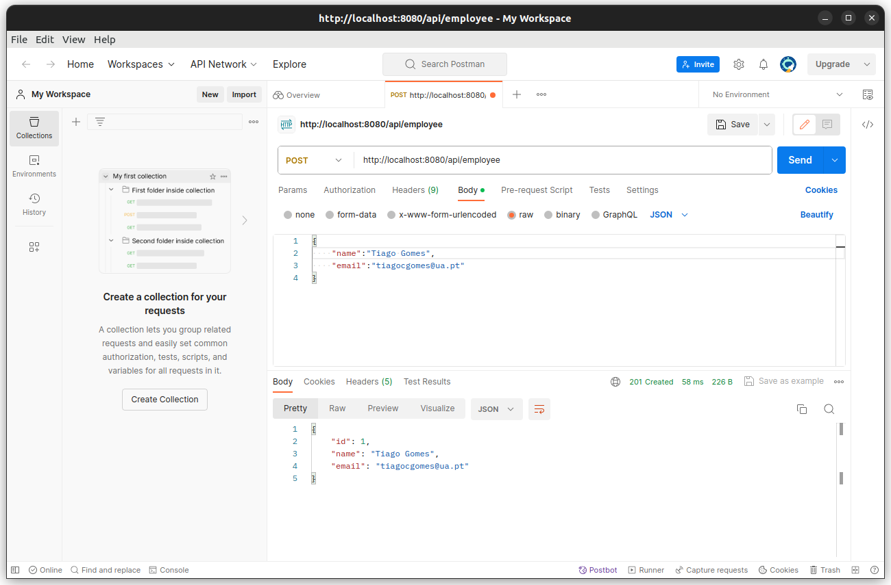
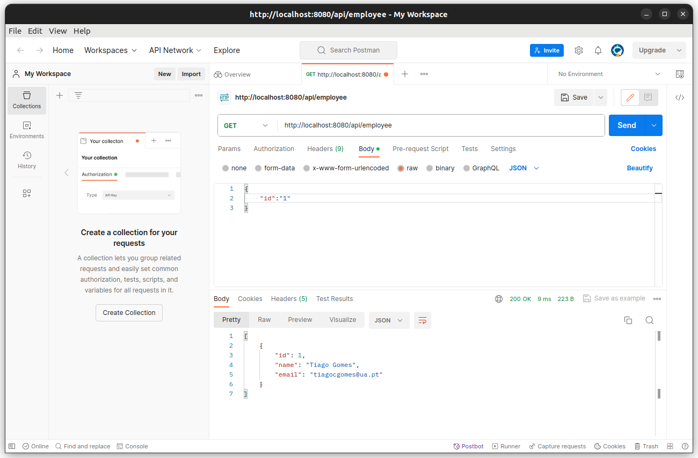
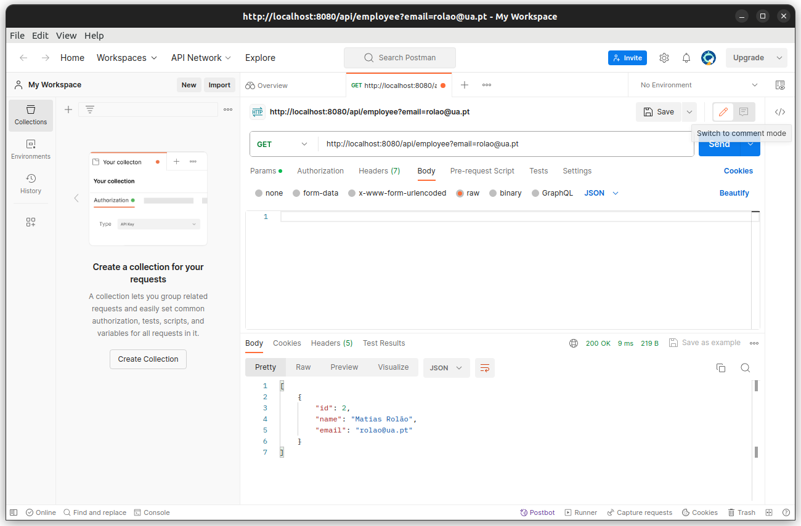
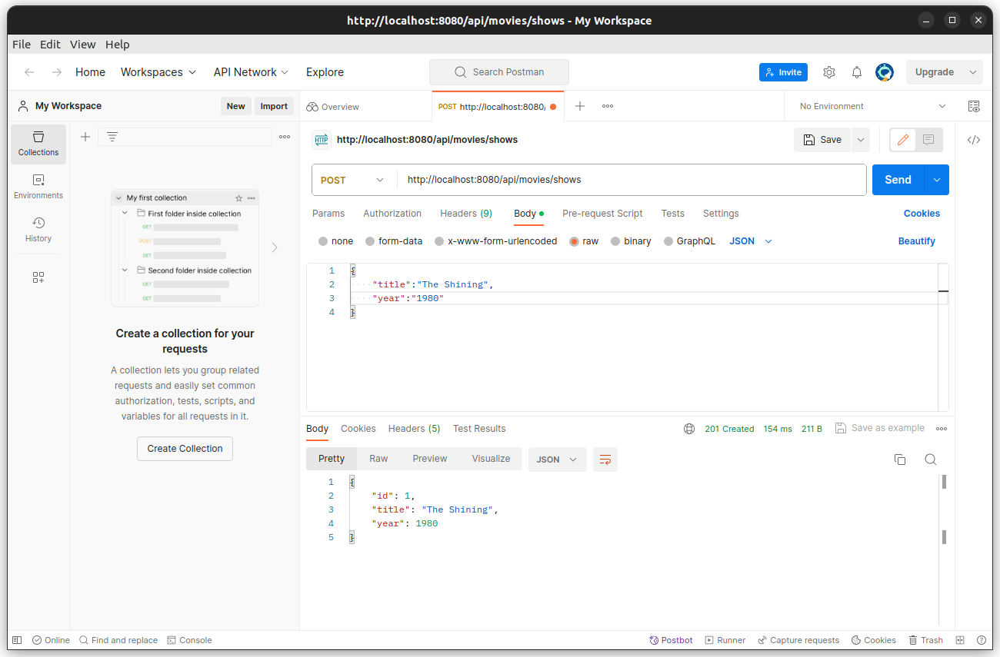
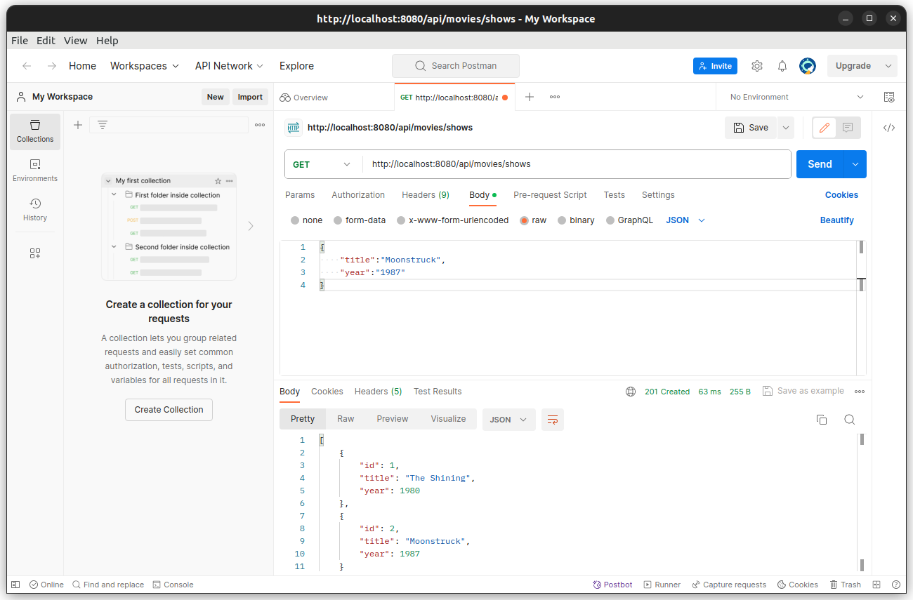
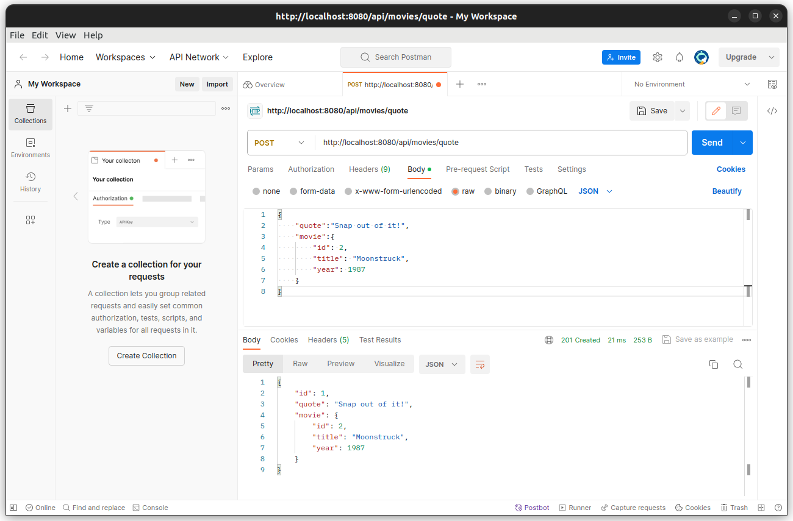
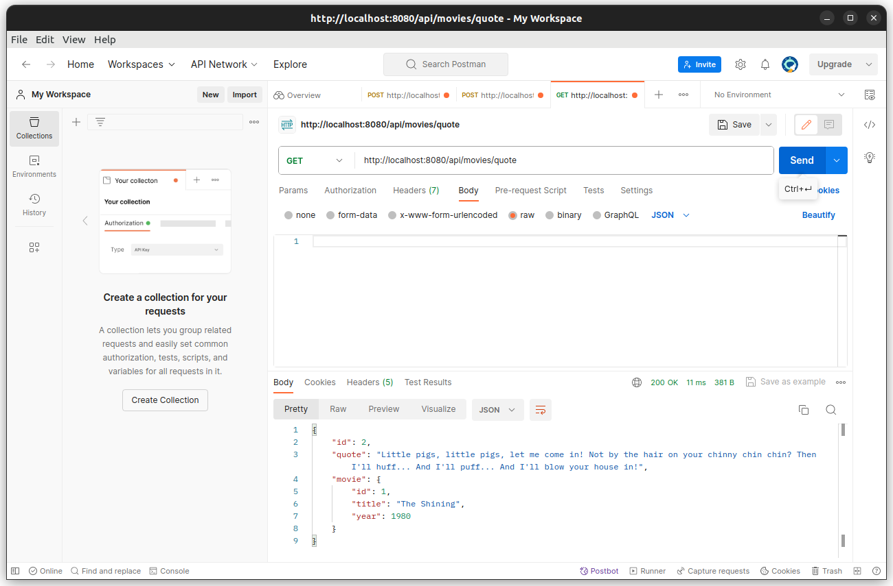
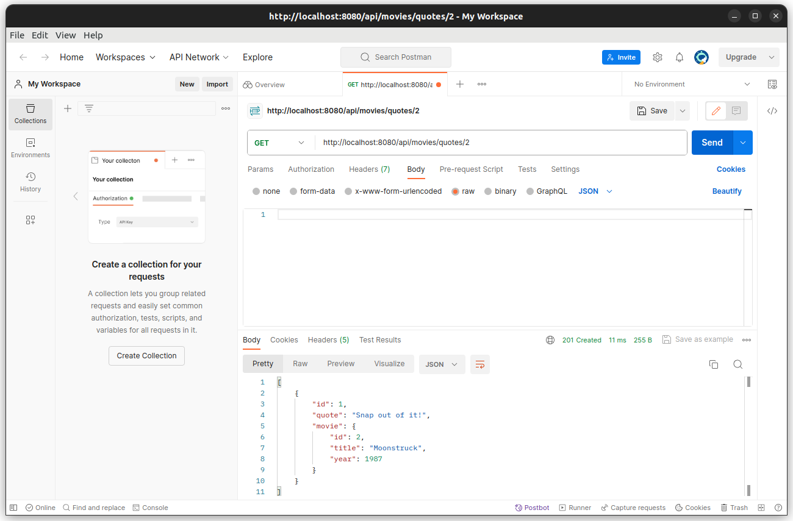

#**Guião Lab3**

**Nome:** Tiago Caridade Gomes <br>
**Nmec:** 108307 <br>
**email:** tiagocgomes@ua.pt

##**Exercício 3.1**

De modo a realizar o que é pedido no exercício, Aplicação Spring Boot CRUD com Thymeleaf, utilizei o Spring Initializer, de modo a criar um projeto maven com as seguintes dependências:
```
<dependencies>
		<dependency>
			<groupId>org.springframework.boot</groupId>
			<artifactId>spring-boot-starter-data-jpa</artifactId>
		</dependency>
		<dependency>
			<groupId>org.springframework.boot</groupId>
			<artifactId>spring-boot-starter-thymeleaf</artifactId>
		</dependency>
		<dependency>
			<groupId>org.springframework.boot</groupId>
			<artifactId>spring-boot-starter-validation</artifactId>
		</dependency>
		<dependency>
			<groupId>org.springframework.boot</groupId>
			<artifactId>spring-boot-starter-web</artifactId>
		</dependency>

		<dependency>
			<groupId>com.h2database</groupId>
			<artifactId>h2</artifactId>
			<scope>runtime</scope>
		</dependency>
		<dependency>
			<groupId>org.springframework.boot</groupId>
			<artifactId>spring-boot-starter-test</artifactId>
			<scope>test</scope>
		</dependency>
	</dependencies>
    ```
De seguida segui o tutorial https://www.baeldung.com/spring-boot-crud-thymeleaf que se  resume à implementação de 3 classes e 3 páginas HTML para efetuar a interação com o utilizador.

Respostas alínea c)

*The "UserController" class gets an instance of "userRepository" through its constructor; how is this new repository instantiated?*

R: O repositório é instanciado pelo mecanismo do Spring Boot: __Bean Autoconfiguration__. Depois da anotação @Autowired.

*List the methods invoked in the "userRepository" object by the "UserController". Where are
these methods defined?*

R: Os métodos invocados são: save(user), findAll(), findById(id), e deleteUser(user). Estes métodos não estão diretamente definidos na classe userRepository. Mas eles são métodos herdados da interface CrudRepository, que é parte do Spring Data JPA.

*Where is the data being saved?*

R: Os dados estão a ser guardados em memória.

*Where is the rule for the "not empty" email address defined?*

R: A regra para a mensagem "not empty" está definida através da notação __@NotBlank__ da biblioteca jakarta.validation.constraints.NotBlank, na classe User.java


##**Exercício 3.2**

Na realizaçãodeste exercício comecei por criar uma instância mwsql com o seguinte comando:

```
bash
docker run --name mysql5 -e MYSQL_ROOT_PASSWORD=secret1 -e MYSQL_DATABASE=demo -e MYSQL_USER=demo -e MYSQL_PASSWORD=secret2 -p 33060:3306 -d mysql/mysql-server:5.7
```

De seguida criei um projeto Maven, através do Spring Initializer com as seguintes depedências, contudo através deste tutorial https://www.javaguides.net/2018/09/spring-boot-2-jpa-mysql-crud-example.html reparei que era necessário adicionar também as dependências relativas ao 'lombok':

```
<dependencies>
		<dependency>
			<groupId>org.springframework.boot</groupId>
			<artifactId>spring-boot-starter-data-jpa</artifactId>
		</dependency>
		<dependency>
			<groupId>org.springframework.boot</groupId>
			<artifactId>spring-boot-starter-validation</artifactId>
		</dependency>
		<dependency>
			<groupId>org.springframework.boot</groupId>
			<artifactId>spring-boot-starter-web</artifactId>
		</dependency>

		<dependency>
			<groupId>org.springframework.boot</groupId>
			<artifactId>spring-boot-devtools</artifactId>
			<scope>runtime</scope>
			<optional>true</optional>
		</dependency>
		<dependency>
			<groupId>com.mysql</groupId>
			<artifactId>mysql-connector-j</artifactId>
			<scope>runtime</scope>
		</dependency>
		<dependency>
			<groupId>org.projectlombok</groupId>
			<artifactId>lombok</artifactId>
			<optional>true</optional>
		</dependency>
		<dependency>
			<groupId>org.springframework.boot</groupId>
			<artifactId>spring-boot-starter-test</artifactId>
			<scope>test</scope>
		</dependency>
	</dependencies>

	<build>
		<plugins>
			<plugin>
				<groupId>org.springframework.boot</groupId>
				<artifactId>spring-boot-maven-plugin</artifactId>
				<configuration>
					<excludes>
						<exclude>
							<groupId>org.projectlombok</groupId>
							<artifactId>lombok</artifactId>
						</exclude>
					</excludes>
				</configuration>
			</plugin>
		</plugins>
	</build>
```
Dei continuidade ao exercício seguindo o tutorial já mencionado.

Para a realização da última alínea alterei o seguinte:

```
public ResponseEntity<List<Employee>> getAllEmployes(@RequestParam(defaultValue = "none") String email){

       
        List<Employee> employee;

        if (email.equals("none")) {
            employee = userService.getAllemployee();
        }
        else {
            employee = userService.getfindByEmail(email);
        }
        return new ResponseEntity<>(employee, HttpStatus.OK);
    }
```

Exemplo de utilização (__Postman__): 
- Insersão:
    
- Procura:
    
- Procura por email:
    

##**Exercício 3.3**

Este exercício é baseado no último exercício do guião passado, mas com a implementação do exercício anterior.

Desta forma a estrutura ficou a seguinte
- Entidades:
    - Movie.java 
    - Quote.java
- Controller:
    - MovieController.java
- Repository:
    - MovieRepository.java
    - QuoteRepository.java
- Service: 
    - Impl:
        - MovieServiceImpl.java
        - QuoteServiceImpl.java
    - MovieService.java
    - QuoteService.java

Exemplo de utilização (__Postman__): 
- Criar novo Filme:
    
- Listar todos os filmes:
    
- Criar nova Quote:
    
- Devolve Random Quote:ProcurarQuoteID
    
- Devolve as todas as quotes de um filme:
    